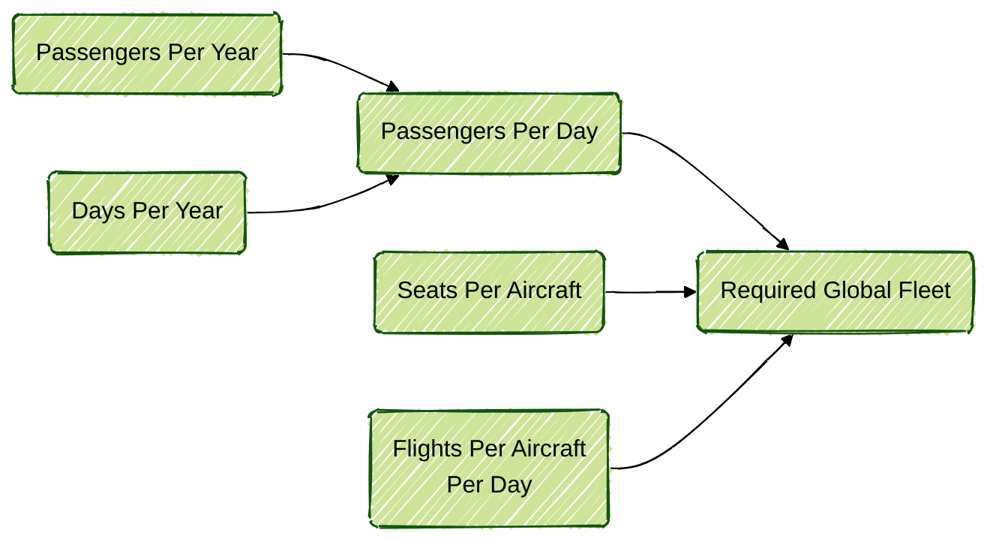

# Aviation

## Documentation

The "required global fleet" can be estimated using a very simple model that assumes the number of passengers flying globally annually is known, along with an estimation of the number of seats flown globally per day.

Many assumptions are made to make the model simple. These include assuming the same aircraft services the same route all year round. Given that the two sources used in this model are given in different time bases, they are converted to per day values to maintain consistency. Equation $\ref{eq:1}$ gives an estimate of the global passengers flying per day:

$$
\begin{equation}
    \text{Passengers Per Day} = \frac{\text{Passengers Per Year}}{\text{Days Per Year}}
    \label{eq:1}
\end{equation}
$$

The total required global fleet can then be calculated as a function of this intermediate value and the other inputs, shown in Equation $\ref{eq:2}$:

$$
\begin{equation}
    \text{Required Global Fleet} = \frac{\text{Passengers Per Day}}{\text{Seats Per Aircraft}\ \times\ \text{Flights Per Aircraft Per Day}}
    \label{eq:2}
\end{equation}
$$

The flow chart below illustrates how these inputs are used to find the global fleet requirement:

With the equations established, we can assign values to these variables using real world data from 2023 and a bit of guess work:

| Variable                     | Value             | Unit     | Source                     |
| ---------------------------- | ----------------- | -------- | -------------------------- |
| Passengers Per Year          | $8.7 \times 10^9$ | year^-1^ | ACI [@aciTrafficForecasts] |
| Seats Per Aircraft           | $181$             | -        | CAA [@caaAviationTrends]   |
| Flights Per Aircraft Per Day | $4$               | day^-1^  | Guess                      |

Putting these numbers into Equations $\ref{eq:1}$ and $\ref{eq:2}$:

$$
\begin{equation}
    \text{Passengers Per Day} = \frac{8.7 \times 10^9}{365.25} = 2.4 \times 10^7
    \label{eq:3}
\end{equation}
$$

$$
\begin{equation}
    \text{Required Global Fleet} = \frac{2.4 \times 10^7}{181 \times\ 4} = 33149
    \label{eq:4}
\end{equation}
$$
